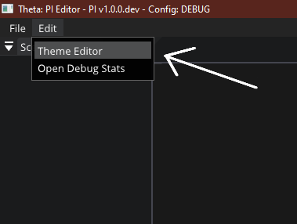
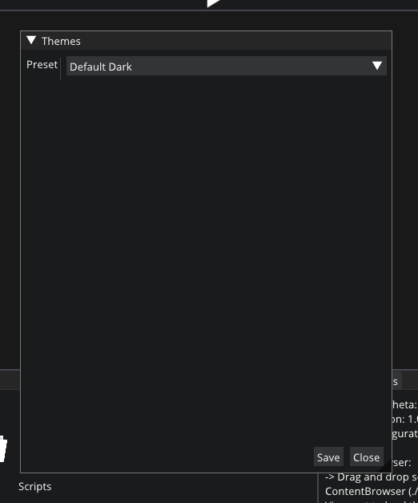

# Theme Editor

Theta is completely customizable in terms of its appearance. To change the theme open the *Theme Editor* window for Edit/Prefferences menu.

The Winwow shuld look something like this:

The default theme is *Default Dark* while editing and *Ruth* while playing (The editor swithches themes while playing).  
There is also a *Default Light* theme.  
You can also customize the themes by setting the preset to *Custom*

**NOTE: The theme you chose will persist between sessions, i.e. it will be saved.**
